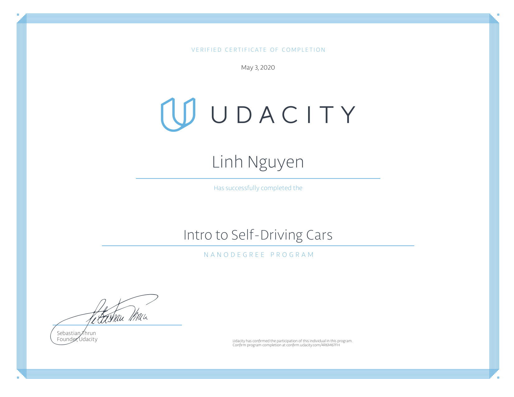

# [Udacity Intro to Self-Driving Cars Nanodegree Program](https://www.udacity.com/course/intro-to-self-driving-cars--nd113)

### This repository consists five projects and related material exercises which let you sharpen your Python skills, apply C++, apply matrices and calculus in code, and touch on computer vision and machine learning. These concepts will be applied to solving self-driving car problems.
----

##### Syllabus 
|Parts                           | Projects                           |
|------------------------- | -------------------               |
|1. Orientation            | None
|2. Baysian Thinking    | [Joy Ride](https://github.com/Hancullen/Udacity-Intro-to-Self-Driving-Cars/tree/master/Joy_Ride)   |
|3. Working with Matrices   | [Implement a Matrix Class](https://github.com/Hancullen/Udacity-Intro-to-Self-Driving-Cars/tree/master/Matrix_Class) |
|4. C++ Basics  | [Translate Python to C++](https://github.com/Hancullen/Udacity-Intro-to-Self-Driving-Cars/tree/master/3.Translate_Python_to_CPP) |
|5. Performance Programming in C++  | [C++ Performance](https://github.com/Hancullen/Udacity-Intro-to-Self-Driving-Cars/tree/master/C%2B%2B_Performance)|
|6. Navigating Data Structures  | [Implement Route Planner](https://github.com/Hancullen/Udacity-Intro-to-Self-Driving-Cars/tree/master/Route_Planner) |
|7. Vehicles Motion and Control | [Constructing Trajectories]() |
|8. Computer Vision and Machine Learning    | [Trafic Light Classifier](https://github.com/Hancullen/Udacity-Intro-to-Self-Driving-Cars/tree/master/Traffic_Lights_Classifier)   |

#### Status: Graduated

****
&copy; Udacity 

