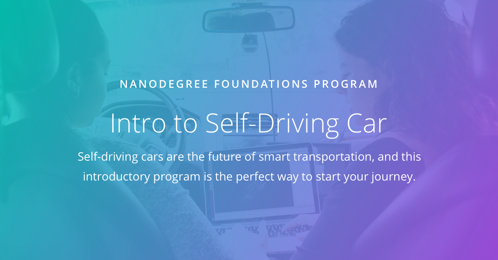

# Udacity Intro to Self-Driving Cars Nanodegree Program

This repository consists projects and related material exercises of [Intro to Self-Driving Cars Nanodegree Program](https://www.udacity.com/course/intro-to-self-driving-cars--nd113)

##### Syllabus 
|Parts                           | Projects                           |
|------------------------- | -------------------               |
|1. Orientation            | None
|2. Baysian Thinking    | [Joy Ride](https://github.com/Hancullen/Udacity-Intro-to-Self-Driving-Cars/tree/master/Joy_Ride)   |
|3. Working with Matrices   | [Implement a Matrix Class]() |
|4. C++ Basics  | [Translate Python to C++]() |
|5. Performance Programming in C++  | None |
|6. Navigating Data Structures  | [Implement Route Planner]() |
|7. Vehicles Motion and Control | None |
|8. Computer Vision and Machine Learning    | [Trafic Light Classifier]()   |

****
&copy; Udacity 

